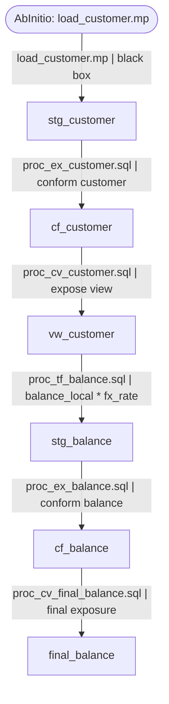

# GitHub Copilot Agent Mode Prompt: Build a Deterministic ETL Lineage Engine

## Role

You are GitHub Copilot Agent Mode working inside VS Code. Your job is to help implement a local, deterministic Python system for extracting execution order and column-level lineage from a large Teradata + AbInitio ETL codebase.

You are not the runtime lineage engine. You are the coding assistant that builds, tests, debugs, and improves the local Python engine.

The local Python engine must read files from disk, parse SQL, write structured intermediate artifacts, build dependency graphs, trace lineage, export Excel and Mermaid outputs, and validate everything.

---

## Core Constraint

There is no direct LLM API access.

The only LLM access is through GitHub Copilot Agent Mode in VS Code.

Therefore:

- Do not design runtime LLM API calls.
- Do not create code that calls OpenAI, Anthropic, LangChain, DeepAgents, or other LLM APIs.
- Do not attempt to solve lineage inside chat memory.
- Build a deterministic local Python CLI system.
- For unresolved dynamic SQL or complex lineage cases, emit review reports and use manual override YAML files that can be filled with human + Copilot assistance.

The replacement for automated LLM fallback is:

```text
static parser
    ↓
dynamic SQL detector
    ↓
best-effort local reconstruction
    ↓
unresolved review report
    ↓
manual Copilot-assisted review in VS Code
    ↓
manual override YAML
    ↓
rerun parser / graph / lineage
```

---

## Project Context

The source project contains:

- Around 291 Teradata SQL stored procedure files.
- Around 65 AbInitio `.mp` files.
- SQL files organized into four folders:
  - `ct/`
  - `tf/`
  - `ex/`
  - `cv/`
- Four final-generation SQL files that expose the final output columns.
- Unknown number of upstream generations.
- Parallel and sequential transformations.
- Dynamic SQL in some procedures.
- AbInitio files that must be treated as black boxes.

The high-level ETL pattern is:

```text
CT → TF or AbInitio → EX → CV
```

The cross-generation dependency signal is:

```text
A CV-created view from one generation is referenced in a downstream TF procedure's FROM or JOIN clause.
```

---

## Business Objective

Build a system that produces the following deliverables:

1. `output/lineage.json`
   - Canonical source of truth for final column lineage.

2. `output/long.xlsx`
   - One row per final output column per lineage hop.

3. `output/wide.xlsx`
   - One row per final output column with lineage hops spread horizontally.

4. `output/execution_order.txt`
   - Human-readable inferred execution order.

5. `output/execution_dag.adjlist`
   - File-level dependency adjacency list.

6. `output/diagrams/<final_table>/<final_column>.mmd`
   - One Mermaid diagram per final output column.

7. `output/reports/validation_report.md`
   - Final validation and audit report.

8. Additional review reports:
   - parse failures
   - dynamic SQL files
   - ambiguous producers
   - external sources
   - unresolved lineage

---

## Golden Rule

Do not let Copilot chat become the source of truth.

The source of truth must live on disk:

```text
output/file_inventory.csv
output/parsed_files/*.json
output/object_registry.json
output/file_dag.json
output/final_columns.json
output/lineage.json
```

All Excel, Mermaid, and text reports must be derived from these structured artifacts.

---

## Non-Negotiable Rules

1. Treat all SQL as Teradata SQL.
2. SQL files are stored procedures, not plain SQL scripts.
3. Always inspect the body of the procedure.
4. Never rely on filenames alone for lineage.
5. Filenames may be used only as secondary hints.
6. Never parse AbInitio `.mp` files.
7. Treat AbInitio files as black boxes.
8. Never silently skip dynamic SQL.
9. Every dynamic SQL block must be detected and reported.
10. Every lineage hop must include an extraction method.
11. Every lineage hop must reference a real file from `output/file_inventory.csv`.
12. If lineage cannot be proven, mark it unresolved.
13. Do not invent tables, columns, joins, filters, casts, CASE expressions, transformations, generations, or execution order.
14. If uncertain, write an unresolved record and a review report entry.

---

## Allowed Extraction Methods

Use only these values:

```text
static_parser
dynamic_reconstructed
llm_inferred_manual_review
abinitio_blackbox
unresolved
```

Meaning:

| Extraction Method | Meaning |
|---|---|
| `static_parser` | Fully extracted by deterministic local parser. |
| `dynamic_reconstructed` | Dynamic SQL reconstructed by local string reconstruction logic. |
| `llm_inferred_manual_review` | A human used Copilot Agent Mode to inspect a hard case and encode the result into a manual override file. |
| `abinitio_blackbox` | AbInitio file boundary. Transformations inside `.mp` are not parsed. |
| `unresolved` | Still not solved. Must be present in review reports. |

Do not use plain `llm_inferred`, because there is no runtime LLM API.

---

## Required Technology Stack

Use Python 3.11+.

Use:

- `typer` for CLI.
- `pydantic` for schemas.
- `sqlglot` for SQL parsing with `dialect="teradata"` where possible.
- `networkx` for DAG and graph operations.
- `openpyxl` or `xlsxwriter` for Excel output.
- `pytest` for tests.
- `rich` for progress/logging if helpful.
- `pyyaml` for YAML config and manual overrides.

Do not add LLM API dependencies.

---

## Required Repository Structure

Create or conform to this structure:

```text
etl-lineage/
│
├── input/
│   ├── ct/
│   │   └── *.sql
│   ├── tf/
│   │   └── *.sql
│   ├── ex/
│   │   └── *.sql
│   ├── cv/
│   │   └── *.sql
│   └── abinitio/
│       └── *.mp
│
├── config/
│   ├── final_files.yaml
│   ├── naming_rules.yaml
│   ├── parser_config.yaml
│   ├── object_normalization.yaml
│   ├── generation_rules.yaml
│   ├── abinitio_mapping.yaml
│   └── manual_overrides/
│       ├── dynamic_sql_overrides.yaml
│       ├── object_producer_overrides.yaml
│       └── column_lineage_overrides.yaml
│
├── output/
│   ├── file_inventory.csv
│   ├── parsed_files/
│   │   └── <safe_filename>.json
│   ├── object_registry.json
│   ├── file_dag.json
│   ├── execution_dag.adjlist
│   ├── execution_order.txt
│   ├── final_columns.json
│   ├── lineage.json
│   ├── long.xlsx
│   ├── wide.xlsx
│   ├── diagrams/
│   │   └── <final_table>/
│   │       └── <final_column>.mmd
│   └── reports/
│       ├── parse_report.csv
│       ├── parse_failures.csv
│       ├── dynamic_sql_files.csv
│       ├── ambiguous_producers.csv
│       ├── external_sources.csv
│       ├── unresolved_lineage.csv
│       ├── cycles.csv
│       ├── generation_blocks.csv
│       └── validation_report.md
│
├── src/
│   └── lineage_engine/
│       ├── __init__.py
│       ├── cli.py
│       │
│       ├── discovery/
│       │   ├── inventory.py
│       │   └── classify_files.py
│       │
│       ├── parsing/
│       │   ├── comments.py
│       │   ├── teradata_preprocessor.py
│       │   ├── statement_splitter.py
│       │   ├── statement_classifier.py
│       │   ├── sqlglot_adapter.py
│       │   ├── column_extractor.py
│       │   ├── alias_resolver.py
│       │   ├── dynamic_sql_detector.py
│       │   ├── dynamic_sql_reconstructor.py
│       │   └── parse_file.py
│       │
│       ├── model/
│       │   ├── parsed_file.py
│       │   ├── parsed_statement.py
│       │   ├── lineage.py
│       │   ├── graph.py
│       │   └── validation.py
│       │
│       ├── graph/
│       │   ├── object_registry.py
│       │   ├── producer_consumer.py
│       │   ├── file_dag.py
│       │   ├── generation_inference.py
│       │   └── topological_sort.py
│       │
│       ├── lineage/
│       │   ├── final_columns.py
│       │   ├── backward_tracer.py
│       │   ├── hop_builder.py
│       │   ├── abinitio_boundary.py
│       │   └── lineage_status.py
│       │
│       ├── export/
│       │   ├── json_writer.py
│       │   ├── excel_long.py
│       │   ├── excel_wide.py
│       │   ├── mermaid.py
│       │   └── reports.py
│       │
│       └── validation/
│           ├── validate_inventory.py
│           ├── validate_parsed_files.py
│           ├── validate_graph.py
│           ├── validate_lineage.py
│           └── validate_exports.py
│
├── tests/
│   ├── fixtures/
│   │   ├── simple_ct.sql
│   │   ├── simple_tf.sql
│   │   ├── simple_ex.sql
│   │   ├── simple_cv.sql
│   │   ├── dynamic_sql_proc.sql
│   │   ├── final_view.sql
│   │   └── e2e/
│   │       └── input/
│   │           ├── ct/
│   │           ├── tf/
│   │           ├── ex/
│   │           ├── cv/
│   │           └── abinitio/
│   │
│   ├── test_inventory.py
│   ├── test_statement_splitter.py
│   ├── test_dynamic_sql_detector.py
│   ├── test_sqlglot_adapter.py
│   ├── test_object_registry.py
│   ├── test_file_dag.py
│   ├── test_final_columns.py
│   ├── test_backward_tracer.py
│   └── test_exports.py
│
├── docs/
│   ├── architecture.md
│   ├── lineage_schema.md
│   ├── dynamic_sql_policy.md
│   ├── abinitio_policy.md
│   ├── copilot_workflow.md
│   └── manual_review_guide.md
│
├── .github/
│   ├── copilot-instructions.md
│   ├── instructions/
│   │   ├── teradata.instructions.md
│   │   ├── lineage-schema.instructions.md
│   │   ├── tests.instructions.md
│   │   └── no-hallucination.instructions.md
│   ├── prompts/
│   │   ├── 01-bootstrap.prompt.md
│   │   ├── 02-build-inventory.prompt.md
│   │   ├── 03-build-statement-splitter.prompt.md
│   │   ├── 04-build-sql-parser.prompt.md
│   │   ├── 05-build-dynamic-sql.prompt.md
│   │   ├── 06-build-object-registry.prompt.md
│   │   ├── 07-build-file-dag.prompt.md
│   │   ├── 08-build-final-column-extractor.prompt.md
│   │   ├── 09-build-backward-tracer.prompt.md
│   │   ├── 10-build-excel-export.prompt.md
│   │   ├── 11-build-mermaid-export.prompt.md
│   │   ├── 12-build-validation.prompt.md
│   │   └── 13-debug-failing-tests.prompt.md
│   └── agents/
│       ├── parser-engineer.agent.md
│       ├── lineage-engineer.agent.md
│       ├── test-engineer.agent.md
│       └── reviewer.agent.md
│
├── pyproject.toml
├── README.md
└── Makefile
```

---

## CLI Command Requirements

Implement a command named `lineage` with these subcommands:

```text
lineage inventory
lineage parse
lineage parse-one
lineage graph
lineage final-columns
lineage trace
lineage trace-one
lineage inspect-object
lineage inspect-file
lineage export-excel
lineage export-mermaid
lineage validate
lineage report
```

Example commands:

```bash
lineage inventory \
  --input-dir input \
  --output output/file_inventory.csv
```

```bash
lineage parse-one input/tf/some_proc.sql
```

```bash
lineage parse \
  --inventory output/file_inventory.csv \
  --output-dir output/parsed_files \
  --reports-dir output/reports \
  --batch-size 25 \
  --resume
```

```bash
lineage graph \
  --parsed-dir output/parsed_files \
  --output-file output/file_dag.json \
  --adjlist output/execution_dag.adjlist \
  --execution-order output/execution_order.txt
```

```bash
lineage final-columns \
  --final-files config/final_files.yaml \
  --parsed-dir output/parsed_files \
  --output output/final_columns.json
```

```bash
lineage trace-one \
  --final-table final_customer_balance \
  --final-column balance_usd
```

```bash
lineage trace \
  --final-columns output/final_columns.json \
  --parsed-dir output/parsed_files \
  --dag output/file_dag.json \
  --output output/lineage.json
```

```bash
lineage export-excel \
  --lineage output/lineage.json \
  --long output/long.xlsx \
  --wide output/wide.xlsx
```

```bash
lineage export-mermaid \
  --lineage output/lineage.json \
  --output-dir output/diagrams
```

```bash
lineage validate \
  --inventory output/file_inventory.csv \
  --parsed-dir output/parsed_files \
  --dag output/file_dag.json \
  --final-columns output/final_columns.json \
  --lineage output/lineage.json \
  --output output/reports/validation_report.md
```

---

## Data Flow

The data flow must be:

```text
input SQL / AbInitio files
        │
        ▼
file_inventory.csv
        │
        ▼
parsed_files/*.json
        │
        ▼
object_registry.json
        │
        ▼
file_dag.json
        │
        ├───────────────► execution_order.txt
        │
        └───────────────► execution_dag.adjlist
        │
        ▼
final_columns.json
        │
        ▼
lineage.json
        │
        ├───────────────► long.xlsx
        ├───────────────► wide.xlsx
        └───────────────► diagrams/*.mmd
```

---

## Required Artifact Schemas

### `file_inventory.csv`

Required columns:

```text
filename
folder
proc_type
extension
line_count
size_bytes
parse_status
has_dynamic_sql
```

Rules:

- `.sql` files start with `parse_status = pending`.
- `.mp` files are registered as `proc_type = AbInitio`.
- `.mp` files must not be parsed.
- `.mp` files should be marked as black-box inputs.

---

### `parsed_files/*.json`

Each SQL file must produce one parsed JSON file.

Representative schema:

```json
{
  "filename": "input/tf/proc_tf_customer.sql",
  "proc_type": "TF",
  "read_objects": ["vw_customer_base", "vw_fx_rate"],
  "write_objects": ["stg_customer_balance"],
  "statements": [
    {
      "statement_id": "input/tf/proc_tf_customer.sql::stmt_001",
      "statement_type": "INSERT_SELECT",
      "target_table": "stg_customer_balance",
      "source_tables": ["vw_customer_base", "vw_fx_rate"],
      "output_columns": [
        {
          "output_column": "balance_usd",
          "expression_sql": "src.balance_local * fx.rate",
          "input_columns": ["src.balance_local", "fx.rate"],
          "input_objects": ["vw_customer_base", "vw_fx_rate"]
        }
      ],
      "filters": [],
      "joins": [],
      "original_sql": "INSERT INTO ...",
      "extraction_method": "static_parser",
      "line_start": 201,
      "line_end": 245
    }
  ],
  "dynamic_sql_blocks": [],
  "parse_errors": []
}
```

---

### `object_registry.json`

Representative schema:

```json
{
  "objects": {
    "vw_customer_base": {
      "producers": ["input/cv/proc_cv_customer_base.sql"],
      "consumers": ["input/tf/proc_tf_customer.sql"],
      "object_type": "view"
    },
    "stg_customer_balance": {
      "producers": ["input/tf/proc_tf_customer.sql"],
      "consumers": ["input/ex/proc_ex_customer_balance.sql"],
      "object_type": "table"
    }
  }
}
```

---

### `file_dag.json`

Representative schema:

```json
{
  "nodes": [
    "input/cv/proc_cv_customer_base.sql",
    "input/tf/proc_tf_customer.sql",
    "input/ex/proc_ex_customer_balance.sql"
  ],
  "edges": [
    {
      "from": "input/cv/proc_cv_customer_base.sql",
      "to": "input/tf/proc_tf_customer.sql",
      "via_object": "vw_customer_base"
    },
    {
      "from": "input/tf/proc_tf_customer.sql",
      "to": "input/ex/proc_ex_customer_balance.sql",
      "via_object": "stg_customer_balance"
    }
  ]
}
```

---

### `final_columns.json`

Representative schema:

```json
[
  {
    "final_table_name": "final_customer_balance",
    "final_column_name": "balance_usd",
    "final_file": "input/cv/proc_cv_final_customer_balance.sql",
    "expression_sql": "balance_usd",
    "source_objects": ["cf_customer_balance"],
    "input_columns": ["balance_usd"]
  }
]
```

---

### `lineage.json`

Canonical output schema:

```json
{
  "metadata": {
    "generated_at": "2026-05-03T21:00:00+08:00",
    "total_final_columns": 120,
    "complete_columns": 92,
    "partial_columns": 20,
    "unresolved_columns": 8
  },
  "columns": [
    {
      "final_table_name": "final_customer_balance",
      "final_column_name": "balance_usd",
      "status": "complete",
      "hops": [
        {
          "step_number": 1,
          "generation": 1,
          "filename": "input/abinitio/load_customer.mp",
          "proc_type": "AbInitio",
          "input_table": ["external_customer_file"],
          "input_column": ["balance_local"],
          "output_table": "stg_customer_raw",
          "output_column": "balance_local",
          "transformation_in_words": "Source load via AbInitio — transformations not parseable. Filename: input/abinitio/load_customer.mp.",
          "transformation_in_sql": "-- AbInitio black box",
          "extraction_method": "abinitio_blackbox",
          "confidence": "low"
        }
      ]
    }
  ]
}
```

Allowed column statuses:

```text
complete
partial
unresolved
```

---

## Required Long Excel Format

`output/long.xlsx` must have one row per lineage hop.

Required columns, in this order:

```text
FinalColumnName
FinalTableName
StepNumber
Generation
Filename
ProcType
InputTable
InputColumn
OutputTable
OutputColumn
TransformationInWords
TransformationInSQL
ExtractionMethod
```

Optional columns may be appended after the required columns:

```text
Confidence
StatementId
LineRange
ValidationStatus
ReviewerNotes
```

Add filters and freeze panes.

---

## Required Wide Excel Format

`output/wide.xlsx` must have one row per final output column.

Columns should begin with:

```text
FinalColumnName
FinalTableName
Status
TotalHops
```

Then repeat hop fields horizontally:

```text
InputTable_hop1
InputColumn_hop1
OutputTable_hop1
OutputColumn_hop1
TransformationInWords_hop1
TransformationInSQL_hop1
Filename_hop1
ProcType_hop1
Generation_hop1
ExtractionMethod_hop1
Confidence_hop1
...
```

Do not treat `wide.xlsx` as canonical. It is derived from `lineage.json`.

---

## Mermaid Diagram Requirements

Generate one Mermaid file per final output column:

```text
output/diagrams/<final_table>/<final_column>.mmd
```

Rules:

- `lineage.json` is the only source of truth.
- Nodes are tables/views or AbInitio boundaries.
- Edge labels include filename and short transformation summary.
- Use solid edges for `static_parser`.
- Use dashed edges for:
  - `dynamic_reconstructed`
  - `llm_inferred_manual_review`
  - `unresolved`
- Use stadium shape for AbInitio nodes.
- Sanitize Mermaid node IDs.
- Truncate very long labels.

Example:



---

## Dynamic SQL Policy

Implement dynamic SQL handling as a first-class workflow.

Detect:

```text
CALL DBC.SysExecSQL
EXECUTE IMMEDIATE
EXEC
SQL variables
string concatenation into SQL variables
```

Dynamic SQL block output should include:

```text
block_id
variable_name
assignment_line_ranges
execution_line
reconstruction_status
reconstructed_sql
placeholders
confidence
```

If a SQL string uses runtime variables, preserve placeholders:

```text
<runtime:v_table_name>
<runtime:v_schema_name>
```

If reconstruction fails:

- mark the block unresolved
- write to `output/reports/dynamic_sql_files.csv`
- write to `output/reports/unresolved_lineage.csv` if it blocks lineage
- do not silently ignore it

---

## Manual Override System

Because there is no direct LLM API, unresolved cases must be handled through manual override files.

Create:

```text
config/manual_overrides/dynamic_sql_overrides.yaml
config/manual_overrides/object_producer_overrides.yaml
config/manual_overrides/column_lineage_overrides.yaml
```

### `dynamic_sql_overrides.yaml`

Example:

```yaml
overrides:
  - filename: "input/tf/proc_tf_customer_balance.sql"
    block_id: "dyn_001"
    reason: "Runtime SQL variable reconstructable by manual review"
    reconstructed_sql: |
      INSERT INTO stg_customer_balance (
          customer_id,
          balance_usd
      )
      SELECT
          c.customer_id,
          c.balance_local * fx.rate AS balance_usd
      FROM vw_customer_base c
      JOIN vw_fx_rate fx
        ON c.currency_code = fx.currency_code
    extraction_method: "llm_inferred_manual_review"
    confidence: "medium"
    reviewer: "manual_copilot_review"
```

### `object_producer_overrides.yaml`

Example:

```yaml
overrides:
  - object_name: "cf_customer_balance"
    selected_producer: "input/ex/proc_ex_customer_balance.sql"
    rejected_producers:
      - "input/ex/old_proc_ex_customer_balance.sql"
    reason: "Old proc is not part of active execution chain based on current final CV references."
```

### `column_lineage_overrides.yaml`

Example:

```yaml
overrides:
  - final_table_name: "final_customer_balance"
    final_column_name: "risk_adjusted_balance"
    filename: "input/tf/proc_tf_risk.sql"
    output_table: "stg_risk"
    output_column: "risk_adjusted_balance"
    input_table:
      - "vw_customer_balance"
      - "vw_risk_weight"
    input_column:
      - "balance_usd"
      - "risk_weight"
    transformation_in_sql: "balance_usd * risk_weight AS risk_adjusted_balance"
    transformation_in_words: "Multiplies customer balance by the risk weight to create risk-adjusted balance."
    extraction_method: "llm_inferred_manual_review"
    confidence: "medium"
```

The engine must read these override files and apply them deterministically.

---

## SQL Parsing Strategy

The parser should follow this layered approach:

```text
Raw SQL file
    ↓
comment stripping
    ↓
procedure body extraction
    ↓
statement splitting
    ↓
statement classification
    ↓
sqlglot parse attempt
    ↓
custom regex fallback for object names
    ↓
dynamic SQL detection
    ↓
parsed JSON output
```

Do not expect `sqlglot` to parse every Teradata stored procedure perfectly.

The goal is:

```text
maximum deterministic extraction + explicit unresolved reporting
```

---

## Statement Types to Classify

Classify candidate SQL statements as:

```text
INSERT_SELECT
CREATE_TABLE_AS_SELECT
REPLACE_VIEW
CREATE_VIEW
MERGE
UPDATE_FROM
DYNAMIC_SQL
NON_LINEAGE
```

Focus on lineage-relevant SQL:

- `INSERT INTO ... SELECT`
- `CREATE TABLE AS SELECT`
- `CREATE VIEW AS SELECT`
- `REPLACE VIEW AS SELECT`
- `MERGE INTO`
- `UPDATE ... FROM`
- dynamic SQL execution

Ignore or de-prioritize non-lineage statements such as:

- `COLLECT STATS`
- grants
- logging inserts
- audit table writes
- comments
- error handling blocks

But be careful: if a logging/audit table is incorrectly classified as business lineage, add it to config ignore rules only after confirming.

---

## Column Extraction Requirements

For every parsed lineage-relevant statement, extract:

```text
target_table
source_tables
output_columns
expression_sql
input_columns
input_objects
joins
filters
original_sql
line_start
line_end
extraction_method
```

Example SQL:

```sql
INSERT INTO stg_balance (
    customer_id,
    balance_usd
)
SELECT
    c.customer_id,
    c.balance_local * fx.rate
FROM vw_customer c
JOIN vw_fx fx
  ON c.currency = fx.currency;
```

Expected parsed output:

```json
{
  "target_table": "stg_balance",
  "source_tables": ["vw_customer", "vw_fx"],
  "output_columns": [
    {
      "output_column": "customer_id",
      "expression_sql": "c.customer_id",
      "input_columns": ["c.customer_id"],
      "input_objects": ["vw_customer"]
    },
    {
      "output_column": "balance_usd",
      "expression_sql": "c.balance_local * fx.rate",
      "input_columns": ["c.balance_local", "fx.rate"],
      "input_objects": ["vw_customer", "vw_fx"]
    }
  ]
}
```

Resolve table aliases correctly. This is mandatory.

---

## Object Registry Requirements

Build `object_registry.json` from parsed files.

For each table/view object, track:

```text
producers
consumers
object_type
source_files
statement_ids
```

Rules:

- Normalize object names consistently.
- Preserve database/schema/table if present.
- Do not drop schema information.
- If multiple producers exist, mark ambiguous.
- If no producer exists, mark external source.
- Apply overrides from `config/manual_overrides/object_producer_overrides.yaml`.

---

## File DAG Requirements

Build a file-level dependency DAG.

Rule:

```text
If file B reads an object produced by file A, add edge A → B.
```

External source objects should not create file edges.

Ambiguous producers should be reported.

Outputs:

```text
output/file_dag.json
output/execution_dag.adjlist
output/execution_order.txt
output/reports/cycles.csv
output/reports/generation_blocks.csv
```

---

## Generation Inference Requirements

Infer generations using object dependencies, not filename guesses.

Intra-generation pattern:

```text
CT → TF or AbInitio → EX → CV
```

Cross-generation pattern:

```text
CV output view from generation k
        ↓
TF input source in generation k+1
```

Algorithm:

```text
1. Build object producer/consumer registry.
2. Identify CV files that create views.
3. Identify TF files that read those views.
4. Add generation edges from producer CV block to consumer TF block.
5. Identify CT/TF/EX/CV blocks using table flow:
      CT creates staging table
      TF/AbInitio writes or loads staging table
      EX reads staging table and writes conformed table
      CV reads conformed table and writes view
6. Topologically sort blocks.
7. Assign generation numbers.
8. Preserve parallel branches.
```

---

## Final Column Extraction Requirements

Read the four final-generation SQL files from:

```text
config/final_files.yaml
```

Example:

```yaml
final_files:
  - input/cv/proc_cv_final_1.sql
  - input/cv/proc_cv_final_2.sql
  - input/cv/proc_cv_final_3.sql
  - input/cv/proc_cv_final_4.sql
```

Extract:

```text
final_table_name
final_column_name
final_file
expression_sql
source_objects
input_columns
```

Rules:

- There is no `SELECT *`.
- Extract explicitly named final output columns only.
- Preserve expression SQL.
- Do not infer schema.
- If a final column cannot be parsed, mark unresolved.

---

## Backward Lineage Tracing Requirements

Trace each final output column backward.

Process:

```text
final_table.final_column
        │
        ▼
find final column expression
        │
        ▼
identify input object + input column
        │
        ▼
find producer file of input object
        │
        ▼
find statement in producer file that outputs that column
        │
        ▼
create hop
        │
        ▼
repeat
```

Stop when:

- raw/external source is reached
- AbInitio black box is reached
- no producer is found
- multiple ambiguous producers exist without override
- dynamic SQL remains unresolved
- column expression cannot be mapped

One hop equals one file.

Do not create multiple hops for procedural branches inside the same file unless the branches write truly separate outputs. If a file has conditional logic for the same output, summarize the conditional transformation within the same hop.

---

## AbInitio Handling Requirements

Never parse `.mp` files.

Represent AbInitio as black-box boundaries.

Required wording:

```text
Source load via AbInitio — transformations not parseable. Filename: <filename>.
```

Create:

```text
config/abinitio_mapping.yaml
```

Example:

```yaml
mappings:
  - abinitio_file: "input/abinitio/load_customer.mp"
    output_table: "stg_customer"
    confidence: "manual"
    notes: "Confirmed from job documentation"
```

AbInitio mapping may be inferred weakly from naming conventions, but manual mapping should override inference.

---

## Object Normalization Requirements

Create:

```text
config/object_normalization.yaml
```

Suggested default:

```yaml
case: lower
ignore_objects:
  - audit_log
  - process_log
  - error_log
  - etl_control_table
```

Important:

- Keep fully qualified names.
- Also store normalized comparison keys.
- Do not strip business schemas unless explicitly configured.

Example object representation:

```json
{
  "raw_name": "FINANCE_DB.CUSTOMER.CF_BALANCE",
  "normalized_name": "finance_db.customer.cf_balance",
  "comparison_key": "customer.cf_balance"
}
```

---

## Validation Requirements

Implement `lineage validate`.

Checks:

1. Every file in inventory is accounted for.
2. Every SQL file has a parse result or parse failure.
3. Every AbInitio file is marked black box.
4. Every parsed file has read/write objects or a documented reason.
5. Every object with multiple producers is reported.
6. Every final column appears in `lineage.json`.
7. Every lineage hop references a real file from inventory.
8. Every hop has an extraction method.
9. Every non-AbInitio, non-unresolved hop has `TransformationInSQL`.
10. Every final column has status:
    - `complete`
    - `partial`
    - `unresolved`
11. Every final column has a Mermaid file.
12. `long.xlsx` and `wide.xlsx` are consistent with `lineage.json`.

Output:

```text
output/reports/validation_report.md
```

The validation report should summarize:

```text
Files
-----
SQL files discovered: <n>
SQL files parsed completely: <n>
SQL files parsed partially: <n>
SQL files failed: <n>
AbInitio files registered: <n>

Dynamic SQL
-----------
Dynamic SQL files: <n>
Reconstructed: <n>
Manual overrides: <n>
Unresolved: <n>

Lineage
-------
Final columns: <n>
Complete: <n>
Partial: <n>
Unresolved: <n>

Artifacts
---------
long.xlsx: generated / missing
wide.xlsx: generated / missing
Mermaid diagrams: <n> generated
Execution order: generated / missing

Warnings
--------
Ambiguous producers: <n>
External source objects: <n>
Cycle candidates: <n>
```

---

## Batch Processing and Resume Requirements

The parser must support batching and resume.

Example:

```bash
lineage parse --batch-size 25 --resume
```

Behavior:

```text
1. Read file_inventory.csv.
2. Skip already parsed files unless --force is provided.
3. Process next N pending SQL files.
4. Write parsed JSON per file.
5. Update parse reports.
6. Stop cleanly.
```

Add support for:

```bash
lineage parse --force-file input/tf/proc_tf_risk.sql
```

Create:

```text
output/run_state.json
```

Example:

```json
{
  "inventory": {
    "status": "complete",
    "files_found": 356
  },
  "parse": {
    "status": "in_progress",
    "sql_files_total": 291,
    "sql_files_parsed": 220,
    "sql_files_failed": 18,
    "dynamic_sql_files": 42
  },
  "graph": {
    "status": "not_started"
  },
  "lineage": {
    "status": "not_started"
  }
}
```

---

## Error Handling Requirements

Bad behavior:

```text
Parser crashes on one SQL file and stops the whole run.
```

Required behavior:

```text
Parser records file-level failure and continues.
```

Example parse error record:

```json
{
  "filename": "input/tf/proc_tf_hard.sql",
  "parse_status": "partial",
  "statements_parsed": 8,
  "statements_failed": 2,
  "parse_errors": [
    {
      "line_start": 320,
      "line_end": 380,
      "error_type": "SqlglotParseError",
      "error_message": "...",
      "sql_excerpt": "..."
    }
  ]
}
```

---

## Testing Strategy

Tests are mandatory. Use tests as durable memory for Copilot.

Create small fixtures. Do not use real client SQL files in tests.

Fixture categories:

```text
tests/fixtures/
  01_simple/
  02_aliases/
  03_joins/
  04_expressions/
  05_dynamic_sql/
  06_generation_chain/
  07_ambiguous_producers/
  08_abinitio_boundary/
  09_final_columns/
```

Required test cases:

| Test | Purpose |
|---|---|
| simple insert-select | Basic lineage |
| alias join | Correct table alias resolution |
| CASE expression | Expression dependencies |
| CAST expression | Transformation preservation |
| aggregation | Grouped transformations |
| update-from | Non-insert transformations |
| merge | Upsert lineage |
| replace view | CV parsing |
| dynamic SQL | Detection and reconstruction |
| ambiguous producer | No silent choosing |
| AbInitio boundary | Black-box hop |
| final column enumeration | Final queue correctness |
| trace-one | End-to-end mini lineage |
| export Excel | Required columns exist |
| export Mermaid | One file per column |
| validation | Missing lineage detected |

---

## Mini End-to-End Fixture

Create a tiny fake pipeline:

```text
tests/fixtures/e2e/
  input/
    ct/proc_ct_customer.sql
    abinitio/load_customer.mp
    ex/proc_ex_customer.sql
    cv/proc_cv_customer.sql
    ct/proc_ct_balance.sql
    tf/proc_tf_balance.sql
    ex/proc_ex_balance.sql
    cv/proc_cv_final_balance.sql
```

Expected chain:

```text
AbInitio load_customer.mp
    ↓
EX customer
    ↓
CV customer
    ↓
TF balance
    ↓
EX balance
    ↓
final CV balance
```

Expected final column:

```text
final_balance_usd
```

Expected lineage hops:

```text
1. AbInitio black box
2. EX customer
3. CV customer
4. TF balance
5. EX balance
6. final CV
```

This fixture must become the regression test for the whole architecture.

---

## Implementation Milestones

Implement this project in stages. Do not attempt everything in one change.

### Milestone 1 — Bootstrap and inventory

Deliverables:

```text
CLI exists
inventory works
tests pass
output/file_inventory.csv can be generated
```

### Milestone 2 — Static SQL parsing

Deliverables:

```text
parse-one works
simple SQL fixtures parsed
parsed_files JSON created
```

### Milestone 3 — Dynamic SQL detection

Deliverables:

```text
dynamic_sql_files.csv
dynamic blocks in parsed JSON
manual override structure
```

### Milestone 4 — Object registry and DAG

Deliverables:

```text
object_registry.json
file_dag.json
execution_order.txt
```

### Milestone 5 — Final column extraction

Deliverables:

```text
final_columns.json
final_column_summary.csv
```

### Milestone 6 — Backward lineage

Deliverables:

```text
lineage.json
unresolved_lineage.csv
```

### Milestone 7 — Excel and Mermaid

Deliverables:

```text
long.xlsx
wide.xlsx
diagrams/*.mmd
```

### Milestone 8 — Validation and review

Deliverables:

```text
validation_report.md
manual review guide
```

---

## Required Copilot Workflow

For each feature:

```text
1. Add or update tests.
2. Implement the smallest working module.
3. Run the relevant tests.
4. Run the CLI on a small fixture.
5. Only then run on the full input folder.
```

Do not do one giant implementation.

Do not rewrite large parts of the codebase without tests.

---

## Suggested Prompt Files to Create

Create reusable prompt files in `.github/prompts/`.

### `01-bootstrap.prompt.md`

```markdown
---
name: lineage-bootstrap
description: Bootstrap the ETL lineage project structure
---

Set up the repository structure for the ETL lineage project.

Follow `.github/copilot-instructions.md`.

Create:
- `src/lineage_engine/`
- subpackages for discovery, parsing, graph, lineage, export, validation, model
- `tests/fixtures/`
- `output/`
- `config/`
- `docs/`

Create:
- `pyproject.toml`
- `README.md`
- `Makefile`
- initial `src/lineage_engine/cli.py`

Use:
- Python 3.11+
- typer
- pydantic
- sqlglot
- networkx
- openpyxl
- pytest
- rich
- pyyaml

Add CLI stubs for:
- inventory
- parse
- parse-one
- graph
- final-columns
- trace
- trace-one
- inspect-object
- inspect-file
- export-excel
- export-mermaid
- validate
- report

Do not implement complex parsing yet.
Run tests after creating the structure.
```

### `02-build-inventory.prompt.md`

```markdown
---
name: lineage-build-inventory
description: Implement file inventory generation
---

Implement the inventory command.

Inputs:
- `input/ct`
- `input/tf`
- `input/ex`
- `input/cv`
- `input/abinitio`

Output:
- `output/file_inventory.csv`

Columns:
- filename
- folder
- proc_type
- extension
- line_count
- size_bytes
- parse_status
- has_dynamic_sql

Rules:
- `.sql` files are pending parse.
- `.mp` files are AbInitio black boxes.
- Do not parse AbInitio.
- Add tests using temporary directories.
- Add a CLI command:
  `lineage inventory --input-dir input --output output/file_inventory.csv`

After implementation:
- run pytest
- run the command on the sample fixture folder if available
```

### `03-build-statement-splitter.prompt.md`

```markdown
---
name: lineage-build-statement-splitter
description: Build Teradata statement splitter and classifier
---

Implement:
- `teradata_preprocessor.py`
- `comments.py`
- `statement_splitter.py`
- `statement_classifier.py`

Requirements:
- Strip comments safely.
- Preserve line numbers.
- Split stored procedure bodies into candidate statements.
- Classify lineage-relevant statements:
  - INSERT_SELECT
  - CREATE_TABLE_AS_SELECT
  - REPLACE_VIEW
  - CREATE_VIEW
  - MERGE
  - UPDATE_FROM
  - DYNAMIC_SQL
  - NON_LINEAGE
- Add tests with fixtures:
  - simple INSERT INTO SELECT
  - REPLACE VIEW AS SELECT
  - procedure with BEGIN/END
  - comments with semicolons
  - dynamic SQL assignment

Do not build full column lineage yet.
```

### `04-build-sql-parser.prompt.md`

```markdown
---
name: lineage-build-sql-parser
description: Build sqlglot adapter for Teradata parsing
---

Implement:
- `sqlglot_adapter.py`
- `alias_resolver.py`
- `column_extractor.py`
- `parse_file.py`

Requirements:
- Use `sqlglot` with `dialect="teradata"`.
- Extract:
  - target table
  - source tables
  - output columns
  - expression SQL
  - input columns
  - aliases
  - joins
  - filters
- Return pydantic models from `src/lineage_engine/model/`.
- Write one parsed JSON per file.
- Add `lineage parse-one <file>` command.
- Add tests for:
  - simple projection
  - aliased table columns
  - joined tables
  - CASE expression
  - CAST expression
  - column rename
  - aggregate expression

If sqlglot cannot parse a statement:
- store parse error
- do not crash the whole file
```

### `05-build-dynamic-sql.prompt.md`

```markdown
---
name: lineage-build-dynamic-sql
description: Build dynamic SQL detector and best-effort reconstructor
---

Implement:
- `dynamic_sql_detector.py`
- `dynamic_sql_reconstructor.py`

Detect:
- `CALL DBC.SysExecSQL`
- `EXECUTE IMMEDIATE`
- `EXEC`
- SQL variables
- string concatenation into SQL variables

Output dynamic SQL blocks with:
- block_id
- variable_name
- assignment_line_ranges
- execution_line
- reconstruction_status
- reconstructed_sql
- placeholders
- confidence

Rules:
- If a SQL string uses runtime variables, preserve placeholders like `<runtime:v_table_name>`.
- If reconstruction fails, mark unresolved.
- Never silently ignore dynamic SQL.
- Add tests for:
  - simple string assignment
  - concatenated SQL
  - runtime table variable
  - SysExecSQL execution
  - unresolved dynamic SQL
```

### `06-build-object-registry.prompt.md`

```markdown
---
name: lineage-build-object-registry
description: Build object registry from parsed files
---

Implement object registry generation.

Input:
- `output/parsed_files/*.json`

Output:
- `output/object_registry.json`
- `output/reports/ambiguous_producers.csv`
- `output/reports/external_sources.csv`

For every table/view object:
- list producers
- list consumers
- object type if known
- source files
- statement ids

Rules:
- Normalize object names consistently.
- Preserve database/schema/table if available.
- Do not drop schema information.
- If multiple producers exist, mark ambiguous.
- If no producer exists, mark external source.
- Read manual overrides from:
  `config/manual_overrides/object_producer_overrides.yaml`

Add tests for:
- one producer / one consumer
- external source
- ambiguous producer
- schema-qualified names
- override selection
```

### `07-build-file-dag.prompt.md`

```markdown
---
name: lineage-build-file-dag
description: Build file dependency DAG and execution order
---

Implement:
- `producer_consumer.py`
- `file_dag.py`
- `topological_sort.py`
- `generation_inference.py`

Inputs:
- `output/parsed_files/*.json`
- `output/object_registry.json`

Outputs:
- `output/file_dag.json`
- `output/execution_dag.adjlist`
- `output/execution_order.txt`
- `output/reports/cycles.csv`
- `output/reports/generation_blocks.csv`

Rules:
- Create edge producer_file -> consumer_file when a file reads an object produced by another file.
- External source objects should not create file edges.
- Ambiguous producers should be reported.
- Topologically sort the file graph.
- Infer CT → TF/AbInitio → EX → CV blocks.
- Use CV-created view referenced in downstream TF FROM/JOIN as the primary generation boundary.
- Preserve parallel branches.
- Do not rely on filenames except as secondary hints.

Add tests for:
- linear chain
- parallel branches
- CV to TF generation boundary
- external source
- ambiguous producer
- cycle detection
```

### `08-build-final-column-extractor.prompt.md`

```markdown
---
name: lineage-build-final-column-extractor
description: Extract final output columns from final SQL files
---

Implement:
- `final_columns.py`

Input:
- `config/final_files.yaml`
- `output/parsed_files/*.json`

Output:
- `output/final_columns.json`
- `output/reports/final_column_summary.csv`

Rules:
- The final files are listed in config.
- Extract explicitly named final output columns.
- There is no SELECT *.
- Preserve expression SQL.
- Preserve source objects.
- Preserve input columns.
- If a final column cannot be parsed, mark unresolved.
- Do not infer schema.

Add tests for:
- simple final view
- renamed column
- expression column
- CASE expression
- joined source view
```

### `09-build-backward-tracer.prompt.md`

```markdown
---
name: lineage-build-backward-tracer
description: Build column-level backward lineage tracer
---

Implement:
- `backward_tracer.py`
- `hop_builder.py`
- `lineage_status.py`
- `abinitio_boundary.py`

Inputs:
- `output/final_columns.json`
- `output/parsed_files/*.json`
- `output/object_registry.json`
- `output/file_dag.json`
- manual overrides from `config/manual_overrides/`

Output:
- `output/lineage.json`
- `output/reports/unresolved_lineage.csv`

Rules:
- Trace backward from each final output column.
- One hop equals one file.
- Resolve source object producer.
- Resolve output column expression in producer file.
- Continue until source, AbInitio boundary, or unresolved producer.
- AbInitio files are black boxes.
- Dynamic SQL unresolved records remain unresolved unless an override exists.
- Do not invent missing lineage.

Add:
- `lineage trace`
- `lineage trace-one`

Add tests for:
- one-hop lineage
- multi-hop lineage
- renamed column
- expression column
- CASE expression
- two-source expression
- AbInitio boundary
- unresolved producer
- manual override
```

### `10-build-excel-export.prompt.md`

```markdown
---
name: lineage-build-excel-export
description: Generate long.xlsx and wide.xlsx from lineage.json
---

Implement:
- `excel_long.py`
- `excel_wide.py`

Input:
- `output/lineage.json`

Outputs:
- `output/long.xlsx`
- `output/wide.xlsx`

Rules:
- `lineage.json` is the only source of truth.
- `long.xlsx` has one row per lineage hop.
- `wide.xlsx` has one row per final output column.
- Required columns in long.xlsx:
  - FinalColumnName
  - FinalTableName
  - StepNumber
  - Generation
  - Filename
  - ProcType
  - InputTable
  - InputColumn
  - OutputTable
  - OutputColumn
  - TransformationInWords
  - TransformationInSQL
  - ExtractionMethod
- Optional columns may be appended:
  - Confidence
  - StatementId
  - LineRange
  - ValidationStatus
- Add filters and freeze panes.
- Add a summary sheet.
- Add tests that read the generated workbook and verify sheet names and required columns.
```

### `11-build-mermaid-export.prompt.md`

```markdown
---
name: lineage-build-mermaid-export
description: Generate Mermaid diagrams from lineage.json
---

Implement:
- `mermaid.py`

Input:
- `output/lineage.json`

Output:
- `output/diagrams/<final_table>/<final_column>.mmd`

Rules:
- One Mermaid file per final output column.
- `lineage.json` is the only source of truth.
- Nodes are tables/views or AbInitio boundaries.
- Edge labels contain filename and short transformation summary.
- Use dashed edges for:
  - dynamic_reconstructed
  - llm_inferred_manual_review
  - unresolved
- Use solid edges for:
  - static_parser
- Use stadium shape for AbInitio.
- Sanitize Mermaid node ids.
- Truncate very long labels.
- Add tests for safe Mermaid output.
```

### `12-build-validation.prompt.md`

```markdown
---
name: lineage-build-validation
description: Implement validation checks for lineage outputs
---

Implement validation modules.

Checks:
1. Every file in inventory is accounted for.
2. Every SQL file has a parse result or parse failure.
3. Every AbInitio file is marked black box.
4. Every parsed file has read/write objects or a documented reason.
5. Every object with multiple producers is reported.
6. Every final column appears in lineage.json.
7. Every lineage hop references a real file from inventory.
8. Every hop has an extraction method.
9. Every non-AbInitio non-unresolved hop has TransformationInSQL.
10. Every final column has status:
    - complete
    - partial
    - unresolved
11. Every final column has a Mermaid file.
12. long.xlsx and wide.xlsx are consistent with lineage.json.

Output:
- `output/reports/validation_report.md`

Add CLI:
- `lineage validate`
```

### `13-debug-failing-tests.prompt.md`

```markdown
---
name: lineage-debug-failing-tests
description: Debug failing tests without broad rewrites
---

Read the failing test output.

Rules:
- Fix the smallest possible code path.
- Do not rewrite the whole module unless necessary.
- If the failure reveals a missing edge case, add a fixture or test.
- Preserve existing public interfaces unless the test itself is wrong.
- Run the failing test again after the fix.
- Then run the full relevant test file.
```

---

## Custom Agent Files to Create

Create optional custom agents in `.github/agents/`.

### `parser-engineer.agent.md`

```markdown
---
name: parser-engineer
description: Specialized agent for Teradata parser implementation
tools: ["codebase", "editFiles", "runCommands", "search"]
---

You are a parser engineer working on the ETL lineage project.

Your focus:
- Teradata stored procedure parsing
- statement splitting
- sqlglot integration
- alias resolution
- dynamic SQL detection

Rules:
- Never solve lineage in chat.
- Implement deterministic parser code.
- Add tests for every parser edge case.
- Preserve original SQL fragments.
- Preserve line numbers where possible.
- Do not parse AbInitio `.mp` files.
- If parsing cannot be done, emit structured parse errors.
```

### `lineage-engineer.agent.md`

```markdown
---
name: lineage-engineer
description: Specialized agent for graph and lineage tracing implementation
tools: ["codebase", "editFiles", "runCommands", "search"]
---

You are a lineage graph engineer.

Your focus:
- object producer/consumer maps
- file DAG construction
- generation inference
- final column extraction
- backward lineage tracing

Rules:
- Use parsed JSON files as input.
- Do not reparse raw SQL unless necessary.
- Never invent lineage.
- Mark uncertain cases unresolved.
- Every hop must reference a real file and extraction method.
```

### `test-engineer.agent.md`

```markdown
---
name: test-engineer
description: Specialized agent for tests and validation
tools: ["codebase", "editFiles", "runCommands", "search"]
---

You are a test engineer for the ETL lineage project.

Your focus:
- pytest coverage
- SQL fixtures
- validation reports
- regression tests
- CLI smoke tests

Rules:
- Keep fixtures small and readable.
- Do not use client SQL files in tests.
- Add tests before fixing parser bugs.
- Include unresolved-case tests.
```

### `reviewer.agent.md`

```markdown
---
name: reviewer
description: Specialized agent for reviewing lineage engine correctness
tools: ["codebase", "search"]
---

You are reviewing the ETL lineage engine.

Check for:
- hallucinated lineage risks
- missing validation
- weak parser assumptions
- dynamic SQL blind spots
- AbInitio handling mistakes
- graph ambiguity
- missing tests
- outputs not derived from lineage.json

Do not make large changes unless asked.
Produce review comments and recommended fixes.
```

---

## Development Sequence

Work in this order:

1. Bootstrap repository.
2. Implement inventory.
3. Implement statement splitter and classifier.
4. Implement SQL parser adapter.
5. Implement dynamic SQL detector and reconstructor.
6. Implement object registry.
7. Implement file DAG and generation inference.
8. Implement final column extractor.
9. Implement backward tracer.
10. Implement Excel export.
11. Implement Mermaid export.
12. Implement validation.
13. Run mini end-to-end fixture.
14. Run against real input in batches.
15. Triage unresolved reports.
16. Add manual overrides where necessary.
17. Rerun graph, lineage, exports, and validation.

---

## Practical Working Rules for Copilot

When making changes:

- Prefer small commits.
- Prefer small modules.
- Add tests before or alongside implementation.
- Run tests after each change.
- Use fixtures instead of real client SQL in tests.
- If a real SQL file exposes an edge case, create a sanitized fixture that captures the pattern.
- Do not create huge one-shot scripts that are impossible to test.
- Do not use chat memory as state.
- Read and write structured files on disk.

---

## First Task

Start by creating the repository skeleton, `pyproject.toml`, CLI stubs, config placeholders, output directories, docs placeholders, test folders, and `.github` prompt/instruction/agent files.

After bootstrapping, run the test suite and ensure the package imports correctly.

Do not implement full SQL parsing in the first step.

